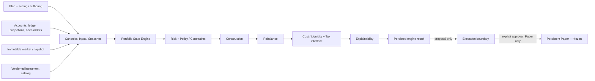

# Investing Engine — Arquitetura Alvo

**Fase:** 2 — arquitetura, fontes de verdade e plano de migração
**Data:** 2026-07-20
**Estado:** decisão arquitetural; sem alteração do engine ou do núcleo operacional
**Baseline:** `docs/INVESTING_ENGINE_PHASE1_BASELINE_MAP_2026-07-20.md`

## 1. Decisão executiva

O Investing passa a ter uma única fronteira financeira: as tabelas `investing_*` e os respetivos RPCs do Persistent Paper são o livro operacional canónico. `portfolio_items`, `portfolios`, `daily_snapshots`, FixNow, broker shared e `/api/daily-bundle` continuam temporariamente apenas como produto legacy/compatibilidade; não podem criar, corrigir ou substituir cash, posições, ordens, fills, accounting ou reconciliation do Investing.

O engine alvo é determinístico, versionado e sem efeitos laterais. Consome um `CanonicalInvestingInput` fechado e persistido, produz um `InvestingEngineResult` fechado e persistido e termina numa **proposta**. Não submete ordens, não escolhe ambiente de execução, não altera posições e não reconcilia.



## 2. Limites que não mudam

- Trading não é alterado e não fornece estado financeiro ao Investing.
- Live permanece impossível na configuração, API, worker e base de dados.
- O núcleo operacional Investing validado permanece congelado; só reabre perante falha reproduzível.
- Research Lab permanece fora do âmbito. O módulo atual `research.ts` é apenas validação heurística do output.
- O browser apresenta comandos e read models; nunca calcula nem envia valores financeiros canónicos.
- O engine nunca executa. A única saída que atravessa a fronteira operacional é uma proposta persistida e validada.
- Não existe dual-write financeiro entre `investing_*` e `portfolio_items`.

## 3. Fontes canónicas por domínio

| Domínio | Fonte canónica alvo | Natureza e regra |
|---|---|---|
| Mandate | `investing_mandate_snapshots` | Snapshot efetivo, imutável, versionado e com hash. `plans`/`user_settings` são inputs de authoring, não o mandato executado. |
| Plan | `plans` durante a transição; `investing_plan_read_model_v1` para consumo | Plano de produto, não financeiro. Apenas o adapter server-side transforma campos permitidos em input do mandato. |
| Settings | `user_settings` durante a transição; projection tipada para o Investing | Preferências e configuração de produto. Campos financeiros derivados ou blobs de broker não entram diretamente no engine. |
| Account | `investing_accounts` | Identidade, owner, portfolio, base currency, environment e status. Paper é obrigatório. |
| Cash | `investing_cash_balances` como projection operacional; `investing_cash_movements` + ledger como prova | O balance serve leituras/locks; deve reconciliar com o ledger. Nunca vem de UI, `portfolios.cash_eur` ou localStorage. |
| Positions | `investing_positions` como projection operacional; fills/corporate actions + ledger como prova | `portfolio_items` deixa de ser posição financeira assim que o consumidor for migrado. |
| Pending orders | `investing_orders` em estados não terminais, relacionados com `investing_execution_queue` | Reservas e efeito projetado entram no input; não são inferidos de eventos de UI. |
| Market snapshot | novos `investing_market_snapshots` + `investing_market_snapshot_items` | Imutável, provider timestamps, received-at, freshness, quality e hash. O engine não chama providers. |
| Target portfolio | `investing_rebalance_ledger.target_portfolio`, ligado ao engine run | Output imutável. Pode ser normalizado mais tarde numa tabela própria sem mudar o contrato. |
| Risk | novo `investing_risk_snapshots` | Métricas, constraints, qualidade, confidence e estado; sempre ligado ao input/run. |
| Rebalance | `investing_rebalance_ledger` | Delta entre estado projetado e target; não é uma ordem. |
| Proposal | `investing_execution_queue` | Proposta aprovada pelo boundary; não representa execução nem fill. |
| Approval | `investing_execution_approvals` | Registo append-only da decisão humana/política e da versão aprovada. |
| Execution | `investing_orders`, `investing_fills`, `investing_fees`, `investing_execution_events` | Persistent Paper congelado; Live proibido. |
| Accounting | `investing_ledger_transactions` + `investing_ledger_entries` | Livro de registo append-only. Cash e positions são projections reconciliáveis. |
| Reconciliation | `investing_reconciliation_runs`, `investing_reconciliation_items`, `investing_reconciliation_resolutions` | Resultado factual, breaks e resolução auditável. `investing_reconciliation_ledger` é compatibilidade/intent legacy. |

A matriz detalhada de componentes e consumidores está em `docs/INVESTING_CANONICAL_SOURCE_MATRIX.md`.

## 4. Arquitetura modular

### 4.1 Canonical Input / Snapshot

Responsabilidades:

- resolver owner, account e portfolio no servidor;
- ler versões concretas de plan/settings, mandato, cash, positions, pending orders, catálogo e mercado;
- normalizar moeda, unidades, timestamps e identificadores;
- calcular e persistir o estado projetado, sem escrever estado financeiro;
- validar completude, freshness e coerência;
- produzir um input imutável com hash.

O adapter legacy pode ler `plans` e `user_settings`, mas não aceita `portfolio_items`, `portfolios`, `daily_snapshots`, payload financeiro do browser ou broker shared como estado financeiro.

### 4.2 Portfolio State Engine

Produz três vistas explícitas:

- `actual`: cash e posições das projections canónicas;
- `reserved`: cash/quantidades reservados por ordens não terminais;
- `projected`: `actual` ajustado pelo efeito máximo conservador das pending orders.

Construction e rebalance usam `projected`, não apenas `actual`. Uma ordem buy aberta reduz cash projetado e aumenta exposição projetada; uma sell aberta reduz quantidade disponível e exposição projetada segundo uma política versionada. Ordens ambíguas ou dados insuficientes degradam ou bloqueiam, nunca desaparecem do cálculo.

### 4.3 Market Data Snapshot

O módulo de aquisição fica fora do engine. Persiste um snapshot fechado antes do cálculo, contendo preço, currency, provider, venue, `providerAsOf`, `receivedAt`, freshness, qualidade e eventuais corporate-action flags. O engine recebe `marketSnapshotId` e os valores desse snapshot; replay não volta a consultar o provider.

Freshness continua fail-closed. Não se baixa a política para fazer um ciclo passar.

### 4.4 Risk Engine

Calcula exposição, concentração, cash buffer, FX, liquidity, turnover, pending-order exposure e disponibilidade de dados. Produz métricas e constraints avaliadas, mas não decide execução. Ausência de dados necessários é `unknown`; para hard constraints, `unknown` bloqueia.

### 4.5 Policy / Constraint Engine

Transforma mandato e políticas versionadas numa lista verificável de constraints:

- `hard`: nunca pode ser ignorada por confidence, UI ou autonomia;
- `soft`: pode produzir warning, degradação ou revisão, mas só através de uma regra versionada;
- `pass`, `fail` ou `unknown`, sempre com reason code e evidência.

Um hard `fail` ou `unknown` força `blocked`. Não existe `overrideAllowed` para hard constraints no contrato alvo.

### 4.6 Construction Engine

É uma função pura `mandate + projected state + catalog + market + constraints -> target portfolio`. O catálogo chega por interface; o módulo não importa diretamente a constante atual. Deve conservar capital, respeitar limites por classe/instrumento, explicitar residual cash e devolver `blocked` quando não consegue satisfazer hard constraints.

### 4.7 Rebalance Engine

Compara target com estado **projetado**, gera deltas em moeda e, apenas quando qualidade e preço permitem, quantidades indicativas. Não cria ordens. Turnover, lot sizes, minimum notional, cash reserve e pending orders são constraints de primeira classe.

### 4.8 Cost / Liquidity Model

Estima fees, spread, slippage, market impact e liquidez por ação. Estimativas incluem origem, versão e confidence. Buckets manuais do motor atual podem sobreviver como fallback `degraded`, nunca como precisão observada.

### 4.9 Tax Interface

É uma porta, não um Tax Engine nesta fase. Recebe lotes, jurisdição/configuração disponível e ações propostas; devolve estimativas ou `unknown`. Sem provider fiscal confiável, vendas fiscalmente sensíveis ficam `degraded` ou `blocked` conforme a política. Não se inventa liability fiscal.

### 4.10 Explainability

Gera reason codes estruturados e uma apresentação derivada. A explicação deve ligar cada target/delta a input, constraint, risco e versão. Texto livre não é a única prova da decisão.

### 4.11 Persistence / Replay

Persiste input, output, versões, hashes, timestamps e links para snapshots. O replay usa exatamente os dados persistidos e não `Date.now()`, quotes atuais ou estado atual da conta. Se input e versões forem iguais, o output e `outputHash` têm de ser iguais.

## 5. Contratos alvo

Os nomes abaixo definem a fronteira; não são autorização para implementar já.

```ts
type EngineState = "ready" | "degraded" | "blocked" | "no_trade";
type DataQuality = "good" | "degraded" | "insufficient";
type ConstraintKind = "hard" | "soft";
type ConstraintStatus = "pass" | "fail" | "unknown";

type VersionSet = {
  contractVersion: "investing-engine-input/v1";
  engineVersion: string;
  policyVersion: string;
  modelVersion: string;
  instrumentCatalogVersion: string;
  marketDataSchemaVersion: string;
};

type QualityIssue = {
  code: string;
  severity: "info" | "warning" | "error";
  domain: string;
  message: string;
  observedAt: string | null;
};

type ConstraintEvaluation = {
  id: string;
  kind: ConstraintKind;
  status: ConstraintStatus;
  reasonCode: string;
  observed: string | null;
  limit: string | null;
  evidenceRefs: string[];
};

type CanonicalInvestingInputV1 = {
  inputSnapshotId: string;
  runId: string;
  userId: string;
  portfolioId: string;
  accountId: string;
  environment: "paper" | "simulation";
  asOf: string;
  versions: VersionSet;
  mandateSnapshotId: string;
  marketSnapshotId: string;
  accountStateVersion: string;
  openOrderSetHash: string;
  actual: CanonicalPortfolioState;
  pendingOrders: CanonicalPendingOrder[];
  projected: CanonicalPortfolioState;
  mandate: CanonicalMandate;
  instruments: CanonicalInstrument[];
  market: CanonicalMarketPoint[];
  quality: { status: DataQuality; issues: QualityIssue[] };
  inputHash: string;
};

type InvestingEngineResultV1 = {
  runId: string;
  inputSnapshotId: string;
  inputHash: string;
  state: EngineState;
  targetPortfolio: TargetAllocation[];
  risk: RiskSnapshot;
  constraints: ConstraintEvaluation[];
  rebalance: RebalanceProposal;
  costs: CostEstimate;
  tax: TaxAssessment;
  confidence: { value: number; basis: string[] };
  warnings: QualityIssue[];
  explanation: ExplanationNode[];
  versions: VersionSet;
  outputHash: string;
};
```

Regras de serialização:

- IDs são UUIDs gerados server-side; IDs funcionais, como `portfolioId`, são normalizados e validados.
- Valores monetários e quantidades persistidos usam decimal exato/strings canónicas, não floats do browser.
- `inputHash` e `outputHash` são SHA-256 de JSON canónico com chaves ordenadas, decimals e timestamps normalizados.
- `asOf` faz parte do input; funções puras não consultam o relógio.
- `confidence` está entre 0 e 1, inclui a base e nunca converte hard fail em pass.
- `degraded` permite recomendação limitada e explícita; `blocked` proíbe proposta executável; `no_trade` é um resultado válido e não um erro.

## 6. Classificação dos motores atuais

| Motor/componente | Classificação | Decisão |
|---|---|---|
| `mandate.ts` | Reutilizável com adaptação | Preservar regras determinísticas como policy v1; retirar inferência solta e receber mandato validado/constraints tipadas. |
| `instrumentMaster.ts` | Heurístico temporário | Manter os quatro instrumentos como universo piloto versionado; separar da construção. |
| `construction.ts` | Candidato a substituição, aproveitável como referência | É puro, mas scores são manuais, cap pode deixar allocation não satisfeita e não há solver formal de constraints. |
| `rebalancing.ts` | Reutilizável com adaptação substancial | A matemática de drift é aproveitável; faltam pending orders, reservas, FX, lotes, custos e estado projetado. |
| `benchmark.ts` | Heurístico temporário | Benchmarks codificados servem apenas como policy piloto; falta série total-return e validação de catálogo. |
| `costs.ts` | Heurístico temporário | Buckets e bps fixos podem ser fallback degradado; não são um modelo observado. |
| `governance.ts` | Reutilizável com adaptação | Reason codes e gates são úteis; separar hard/soft e eliminar override de hard constraints. |
| `research.ts` | Incompleto | Manter como validation/explainability piloto; não é Research Lab nem evidência de mercado. |
| `execution.ts` | Reutilizável com adaptação e renomeação conceptual | É proposal planning; remover linguagem que pareça executar e ligar ao boundary canónico. |
| `runtimeAdapter.ts` | Legacy/candidato a substituição gradual | Atualmente aceita objetos soltos, infere inputs e mistura aquisição, heurísticas e orchestration. Fica atrás de compatibility adapter até ao cutover. |
| `persistence.ts` | Reutilizável com adaptação | `stableJsonStringify`/SHA-256 são base útil; normalização de data com relógio e envelopes incompletos devem ser corrigidos no contrato v1. |
| `server/dailyCycle.ts` | Reutilizável com adaptação | Boa fronteira server-side e persistência atómica; hoje consulta quotes durante o ciclo e ignora pending orders no estado projetado. |
| `server/dashboard.ts` | Reutilizável com adaptação | Já lê cash/positions/orders canónicos; deve consumir read model e engine run persistido, sem recalcular com quotes atuais a cada GET. |
| `accounting/ledger.ts`, `execution/controls.ts`, `execution/stateMachine.ts`, paper adapter TS | Test-only | Não promover a runtime; PostgreSQL/RPCs continuam autoridade operacional. |
| RPCs/workers Persistent Paper | Reutilizável sem alteração nesta fase | Núcleo operacional congelado e fora do engine. |
| FixNow/engine shared/broker shared | Legacy para Investing | Bloquear na fronteira Investing; preservar Trading sem modificação. |

## 7. Estratégia do `instrumentMaster`

O catálogo atual permanece como `StaticPilotInstrumentCatalog/v1`. A próxima interface é:

```ts
interface InstrumentCatalogPort {
  getVersion(): string;
  getBySymbols(symbols: string[], asOf: string): Promise<CanonicalInstrument[]>;
  listEligible(mandate: CanonicalMandate, asOf: string): Promise<CanonicalInstrument[]>;
}
```

A implementação piloto apenas embrulha `getCanonicalInvestingInstrumentMaster()`. Construction, benchmark, cost, risk e tax recebem os registos por input e deixam de importar a constante. A interface prepara um catálogo/dataset futuro, mas não recolhe research, não expande o universo automaticamente e não constrói Research Lab.

## 8. Auditoria do caminho `/api/engine/loop -> syncBrokerToPortfolio`

### Resultado: risco reproduzido e provado

O comportamento shared pode executar quando `active_mode=investing`:

1. `lib/engine/loop.ts:104-130` lê `user_settings.active_mode` e cria um target com `mode="investing"`; não existe exclusão por domínio.
2. Se a ligação estiver connected, com prova, `autoSync` e estiver due — ou `force=true` — o loop não-dry-run chega a `lib/engine/loop.ts:302-306`.
3. A chamada interna entra em `lib/broker/sync.ts:396-439`. Não passa pela guarda HTTP de `app/api/broker/sync/route.ts:35-40`.
4. `writePortfolioState` pode inserir, atualizar e apagar `portfolio_items` (`lib/broker/sync.ts:256-274`), e faz upsert em `portfolios` e `daily_snapshots` (`lib/broker/sync.ts:285-330+`).
5. Só depois o loop chama reconciliation. Não transforma esse snapshot em accounting canónico, fills ou `investing_positions`; portanto pode criar divergência entre a UI legacy e o livro Investing.
6. `vercel.json:16-17` agenda `/api/engine/loop` diariamente às 03:15.

Prova isolada executada nesta Fase 2:

```text
npx vitest run tests/.codexInvestingEngineLoopRisk.test.ts
1 test passed
scenario: active_mode=investing + connected CSV broker + autoSync + force=true
assertion: syncBrokerToPortfolio({ userId, mode: "investing", ... }) called once
```

O teste era instrumentação descartável, usou mocks locais, não contactou staging/produção e foi removido após a execução. Não foi alterado código do engine.

### Impacto identificado

- mutação/delete de holdings legacy de Investing;
- alteração de snapshots e indicadores consumidos por Plan/Portfolio/Advisor/Autonomy;
- possível apresentação de uma carteira diferente de `investing_positions` e do ledger;
- eventos com nomes `order_sent`/`order_filled` sem ordens/fills canónicos;
- a route `/api/broker/sync` também pode ser contornada quando o request omite `mode`: a guarda inspeciona o modo pedido antes de resolver o modo efetivo;
- `/api/broker/reconcile` com `refresh=true` chama o mesmo sync sem uma guarda Investing equivalente.

### Plano de bloqueio seguro para a Fase 3

Primeira implementação, antes do novo engine:

1. guarda central de domínio antes de qualquer efeito lateral em `runEngineLoop`;
2. defesa em profundidade dentro de `syncBrokerToPortfolio`, tornando Investing um input impossível para shared sync;
3. guardar `/api/broker/sync` depois de resolver o modo efetivo e guardar `/api/broker/reconcile` no refresh;
4. devolver/medir `investing_shared_broker_sync_blocked`, sem eventos falsos de ordem/fill;
5. testes para target direto, fallback journal, `force`, modo omitido, reconcile refresh e regressão de Trading;
6. cron continua operacional para domínios permitidos e apenas ignora Investing.

Não se implementa este bloqueio na Fase 2 porque a instrução é fechar primeiro fluxo, impacto, testes e plano. Estes quatro elementos estão agora definidos.

## 9. Invariantes obrigatórias

1. Existe uma única fonte de verdade financeira: o livro/projections `investing_*`.
2. Mesmo input, mesmas versões e mesmo catálogo produzem exatamente o mesmo output/hash.
3. O engine termina numa proposta; nunca executa, aprova, faz fill, accounting ou reconciliation.
4. Browser/localStorage nunca decide cash, posições, preço, valuation, reservas ou estado de ordem canónicos.
5. Pending orders entram explicitamente no estado projetado.
6. Hard constraints não podem ser ignoradas nem por autonomy, approval, confidence ou compatibility layer.
7. Dados insuficientes não são substituídos por valores inventados; degradam ou bloqueiam.
8. Nenhum caminho shared/FixNow escreve estado financeiro Investing.
9. Live permanece impossível e Trading não é modificado.
10. Cada decisão persistida referencia input, market snapshot, versões, hashes e reason codes.
11. Replay não consulta estado externo nem o relógio.
12. `portfolio_items` nunca volta a ser posição financeira canónica depois do cutover.

## 10. Dependência de validação residual

Permanece uma dependência de validação operacional, não uma falha do engine:

> Repetir em janela de mercado, com fonte de cotação isolada própria de staging, o fluxo autenticado da queue aprovada desde submit até partial fill, fill e reconciled, preservando todas as políticas atuais.

O branch Supabase de staging usado anteriormente foi removido por instrução explícita em 2026-07-20. Antes de migrations ou validação PostgreSQL da Fase 3 deve ser criado um ambiente isolado novo, sem dados/secrets de produção. A limitação não bloqueia design nem desenvolvimento puro, mas bloqueia qualquer promoção operacional.

## 11. Decisões para a Fase 3

- **Primeiro:** bloquear o caminho shared broker para Investing com defesa em profundidade e testes de não-regressão.
- **Depois:** contratos v1, canonical snapshot builder e replay puro, ainda sem cutover de UI.
- **Módulos reaproveitados:** hashing/persistence, mandate, drift/rebalance, governance reason codes e boundary server-side, todos por adapters/versionamento.
- **Módulos novos:** input snapshot, market snapshot, portfolio projected state, risk, constraints, catalog port, tax port, explainability e run/replay.
- **Legacy temporário:** `plans`, `user_settings`, `/api/daily-bundle`, `portfolio_items` e quatro tabs não-Daily, somente atrás de adapters/read models e sem escrita financeira canónica.
- **Bloqueios:** shared broker path, inexistência de market snapshot imutável, ausência de pending orders no cálculo, ambiguidade de backfill legacy e staging isolado por recriar.
